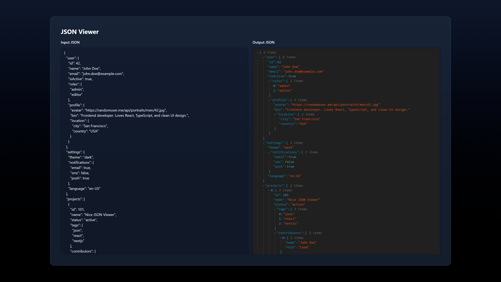

<a id="readme-top"></a>

<br />
<div align="center">
  <a href="https://github.com/yungKillaGit/nice-json-viewer">
    
  </a>

  <h3 align="center">Nice JSON Viewer</h3>

  <p align="center">
    Paste your JSON and get a readable, formatted output instantly.
    <br />
    <a href="https://github.com/yungKillaGit/nice-json-viewer"><strong>Explore the docs »</strong></a>
  </p>
</div>

<details>
  <summary>Table of Contents</summary>
  <ol>
    <li><a href="#about-the-project">About The Project</a>
      <ul><li><a href="#built-with">Built With</a></li></ul>
    </li>
    <li><a href="#getting-started">Getting Started</a>
      <ul>
        <li><a href="#prerequisites">Prerequisites</a></li>
        <li><a href="#installation">Installation</a></li>
      </ul>
    </li>
    <li><a href="#roadmap">Roadmap</a></li>
    <li><a href="#license">License</a></li>
    <li><a href="#contact">Contact</a></li>
  </ol>
</details>

## About The Project

[](https://nice-json-viewer.vercel.app)

Nice JSON Viewer is a tool for quickly viewing JSON in a readable format. Just paste your JSON and instantly get a clean, structured result with no extra steps.

## Built With
* [Next.js](https://nextjs.org/)
* [React](https://reactjs.org/)
* [Tailwind CSS](https://tailwindcss.com/)
* [@uiw/react-json-view](https://github.com/uiwjs/react-json-view)

## Getting Started

To get a local copy up and running, follow these steps.

### Prerequisites
* Node.js >= 24

### Installation

1. Clone the repo
   ```sh
   git clone https://github.com/yungKillaGit/nice-json-viewer.git
   cd nice-json-viewer
   ```
2. Install dependencies
   ```sh
   npm install
   ```
3. Start the development server
   ```sh
   npm run dev
   ```
4. Open [http://localhost:3000](http://localhost:3000) in your browser

See the [open issues](https://github.com/yungKillaGit/nice-json-viewer/issues) for a full list of proposed features (and known issues).


## Roadmap

- [x] Error handling
- [x] Display formatted JSON
- [x] Save entered JSON
- [x] Import/Export JSON
- [ ] Search

## License

Distributed under the MIT License. See `LICENSE.txt` for more information.

## Contact

Maintainer: [yungKillaGit](https://github.com/yungKillaGit)
<br>
Project Link: [https://github.com/yungKillaGit/nice-json-viewer](https://github.com/yungKillaGit/nice-json-viewer)